# Game-Checkpoint_Angular-Express (Dockerfile)

Creador: Fco. Javier Diez Garcia

Tipo: CFGS Proyect

Instituto: IES L'Estacio

Curso: Web Applications Development

# Index

- [Game-Checkpoint_Angular-Express (Dockerfile)](#game-checkpoint_angular-express-dockerfile)
- [Index](#index)
- [Introduction](#introduction)
- [Steps](#steps)
  - [1. Tag Repositorio](#1-tag-repositorio)
  - [2. Comprobacion Repositorio Remoto](#2-comprobacion-repositorio-remoto)
  - [3. Creacion Rama 'main_dockerfile'](#3-creacion-rama-main_dockerfile)
  - [4. Creacion Directorio y Archivos](#4-creacion-directorio-y-archivos)
  - [5. Preparacion del primer commit](#5-preparacion-del-primer-commit)
  - [6. Construccion del Script "docker_creation"](#6-construccion-del-script-docker_creation)
  - [7. Creacion Dockerfile MongoDB](#7-creacion-dockerfile-mongodb)
  - [8. Creacion Dockerfile Angular](#8-creacion-dockerfile-angular)
  - [9. Creacion Dockerfile Express](#9-creacion-dockerfile-express)
  - [10. Creacion del config.env](#10-creacion-del-configenv)
  - [11. Cambio de funcion en Express](#11-cambio-de-funcion-en-express)
  - [12. Push al repositiorio Remoto](#12-push-al-repositiorio-remoto)
  - [13. Clon del repositorio y ejecucion del script](#13-clon-del-repositorio-y-ejecucion-del-script)

# Introduction


Mediante un script haremos que Docker cree 3 imagenes si los conetenedores no existen, crearlos y si existen los arrancaramos.

Tambien se creara una red para que esten comunicados y se pasaran los archivos necesarios para el funcionamiento de estos.


# Steps


## 1. Tag Repositorio

> En este paso hemos creado el tag y hemos hecho un push al repositorio remoto
>
>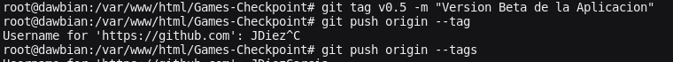

```bash
# Comandos Utilizados:
git tag v0.5 -m "Version Beta de la Aplicacion";
git push origin --tags;
```

## 2. Comprobacion Repositorio Remoto
> A continuacion comprobamos que en el repositiorio esta el nuevo tag
>
>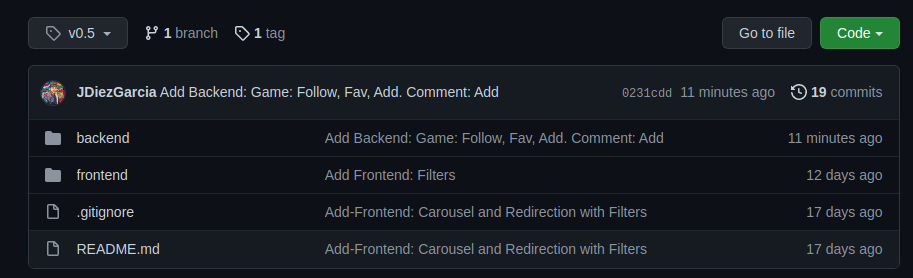

## 3. Creacion Rama 'main_dockerfile'
> Lo siguiente es crear la rama main_dockerfile donde tendremos todo lo nuevo sin afectar a la rama principal
> 
> 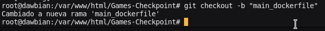
```bash
# Comando Utilizado:
git checkout -b "main_dockerfile";
```

## 4. Creacion Directorio y Archivos
> Creamos la carpeta que contendra los archivos dockerfile y los archivos que queramos copiar mediante el dockerfile (la basede datos y el archivo config.env con la variables de express )
> 
> 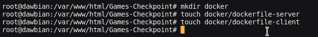
```bash
# Comandos Utilizados:
mkdir docker;
touch docker/dockerfile-server;
touch docker/dockerfile-client;
touch docker/dockerfile-db;
touch docker/config.env;
touch docker_creation.sh;
```

## 5. Preparacion del primer commit

> Creamos la carpeta que contendra los archivos dockerfile y los archivos que queramos copiar mediante el dockerfile (la basede datos y el archivo config.env con la variables de express )
> 
>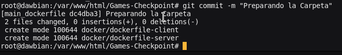
```bash
# Comandos Utilizados:
git add .;
git commit -m "Preparando la Carpeta";
```

## 6. Construccion del Script "docker_creation"
> Creamos el script que comprobara si existen los contenedores, si existen devolveran 0, 1, 2 y 3, cada uno significando una condicion distinta (no existen, existe express, existe angular y existen los dos).
> 
> Despues tendremos las 3 funciones que dependiendo de los resultados anteriores crearan el contenedor la imagen y el contenedor sino existe el contenedor y si existen los arrancaran.
>
> Por ultimo ejecutamos las funciones, creamos la red de los contenedores, copiamos el confing.env en la carpeta de backend/config y exportamos la base de datos mediante un comando hacia el contenedor.
> 
>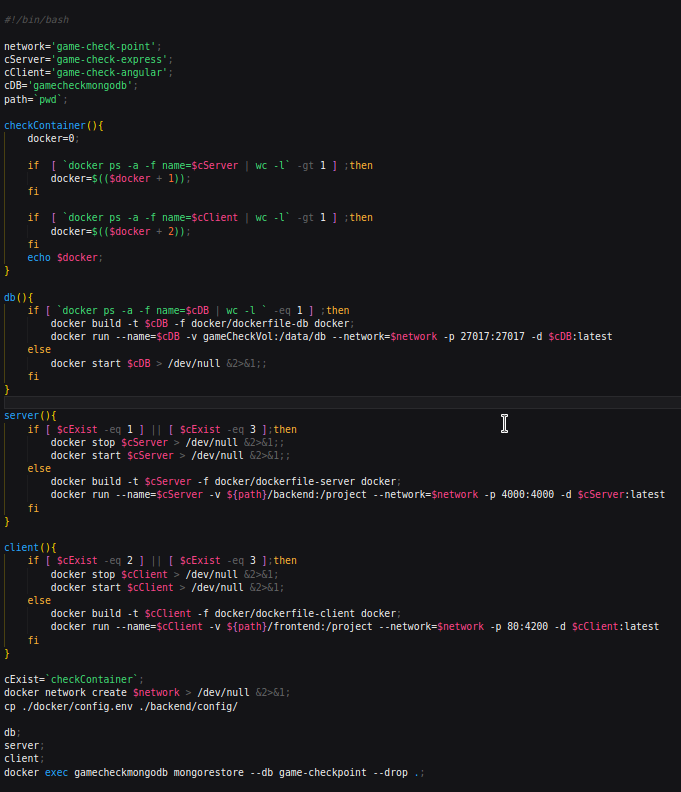

```sh
#!/bin/bash

#!/bin/bash

network='game-check-point';
cServer='game-check-express';
cClient='game-check-angular';
cDB='gamecheckmongodb';
path=`pwd`;

checkContainer(){
    docker=0;
    
    if  [ `docker ps -a -f name=$cServer | wc -l` -gt 1 ] ;then
        docker=$(($docker + 1));
    fi
    
    if  [ `docker ps -a -f name=$cClient | wc -l` -gt 1 ] ;then
        docker=$(($docker + 2));
    fi
    echo $docker;
}

db(){
    if [ `docker ps -a -f name=$cDB | wc -l ` -eq 1 ] ;then
        docker build -t $cDB -f docker/dockerfile-db docker;
        docker run --name=$cDB -v gameCheckVol:/data/db --network=$network -p 27017:27017 -d $cDB:latest
    else
        docker start $cDB > /dev/null &2>&1;;
    fi
}

server(){
    if [ $cExist -eq 1 ] || [ $cExist -eq 3 ];then
        docker stop $cServer > /dev/null &2>&1;
        docker start $cServer > /dev/null &2>&1;
    else
        docker build -t $cServer -f docker/dockerfile-server docker;
        docker run --name=$cServer -v ${path}/backend:/project --network=$network -p 4000:4000 -d $cServer:latest
    fi
}

client(){
    if [ $cExist -eq 2 ] || [ $cExist -eq 3 ];then
        docker stop $cClient > /dev/null &2>&1;
        docker start $cClient > /dev/null &2>&1;
    else
        docker build -t $cClient -f docker/dockerfile-client docker;
        docker run --name=$cClient -v ${path}/frontend:/project --network=$network -p 80:4200 -d $cClient:latest
    fi
}

cExist=`checkContainer`;
docker network create $network > /dev/null &2>&1;
cp ./docker/config.env ./backend/config/

db;
server;
client;
docker exec gamecheckmongodb mongorestore --db game-checkpoint --drop .;

```
## 7. Creacion Dockerfile MongoDB
> Cogemos la imagen de mongo, creamos el diretorio padre e hijo /dump/checkpoint, nos situamos en ese ultimo y hacemos una copia de la base de datos a la imagen.
> 
>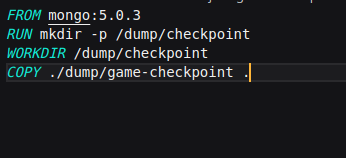
```dockerfile
FROM mongo:5.0.3
RUN mkdir -p /dump/checkpoint
WORKDIR /dump/checkpoint
COPY ./dump/game-checkpoint .
```


## 8. Creacion Dockerfile Angular
> Cogemos la imagen de node:16.12.0-buster-slim por su ligereza, creamos el directorio del proyecto y lo hacemos nuestro directorio de trabajo y por ultimo ponemos de comando de arranque el npm install y el run start.
> 
>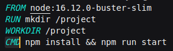

```dockerfile
FROM node:16.12.0-buster-slim
RUN mkdir /project
WORKDIR /project
CMD npm install && npm run start
```
## 9. Creacion Dockerfile Express
> Cogemos la misma configuracion de Angular cambiando unicamente el run start por dev
> 
>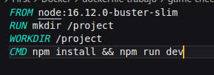

```dockerfile
FROM node:16.12.0-buster-slim
RUN mkdir /project
WORKDIR /project
CMD npm install && npm run dev
```
## 10. Creacion del config.env
> Creamos las dos variables necesarias para el proyecto de express dandole el nombre del contenedor de mongo y poniendo un secret default para cambiar luego
> 
>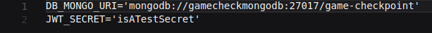
```env
DB_MONGO_URI='mongodb://gamecheckmongodb:27017/game-checkpoint'
JWT_SECRET='isATestSecret'
```
## 11. Cambio de funcion en Express
> Cambiamos la funcion de Mongoose para conectarnos, haciendo que ahora intente conectarse cada X tiempo solucionando problemas en la ejecucion de los contenedores por que este listo o no mongoDB
> 
>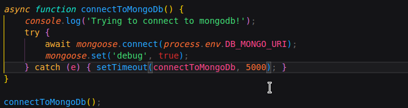
```js
async function connectToMongoDB(){
    console.log('Trying to connect to mongodb!');
    try{
        await mongoose.connect(process.env.DB_MONGO_URI);
        mongoose.set('debug', true);
    } catch (e) { setTimeout(connectToMongoDb, 5000); }
}

connectToMongoDb();
```
## 12. Push al repositiorio Remoto
> Una vez hecho todos los cambios necesarios hacemos un push de la rama al repositorio remoto.
> 
>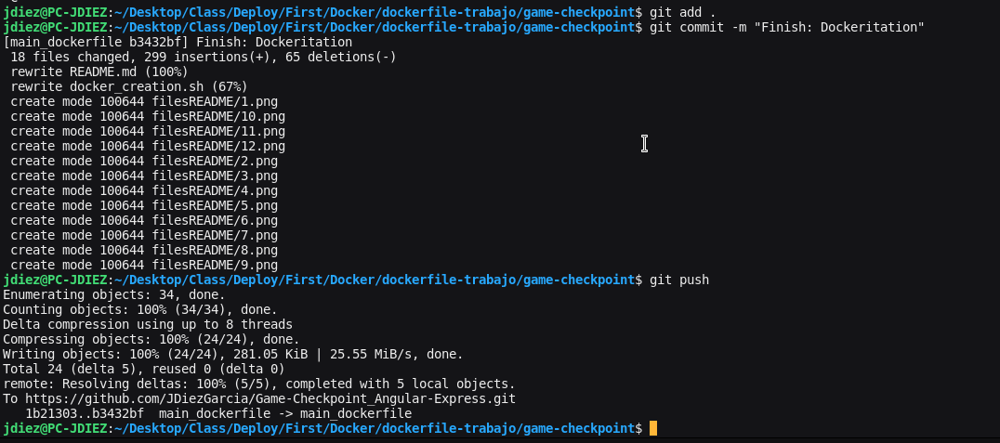
```bash
git add .;
git commit;
git push origin main_dockerfile;
```
## 13. Clon del repositorio y ejecucion del script
> El paso final es clonar el repositorio dar permisos al script y ejecutar-lo una vez hecho eso estamos listos para utilizar la aplicacion
> 
>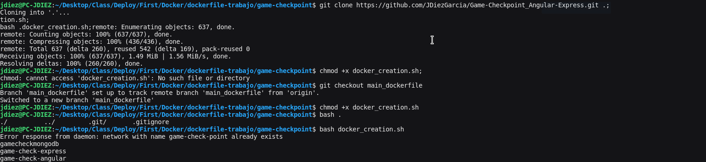
```bash
git clone https://github.com/JDiezGarcia/Game-Checkpoint_Angular-Express.git .;
git checkout main_dockerfile;
chmod +x docker_creation.sh;
bash docker_creation.sh;
```
