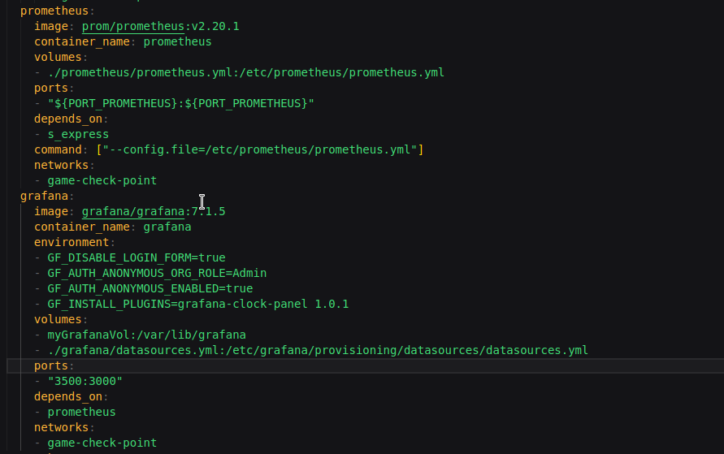
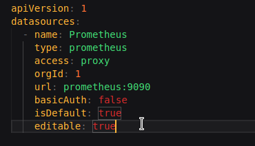
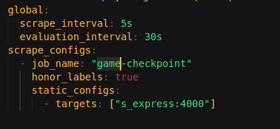
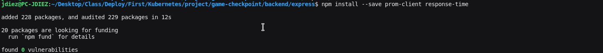
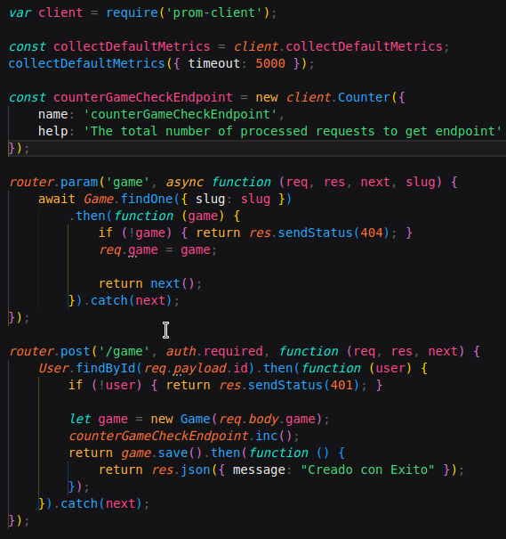
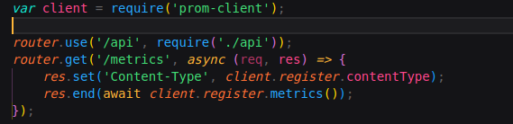
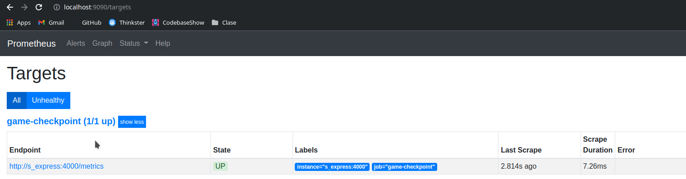
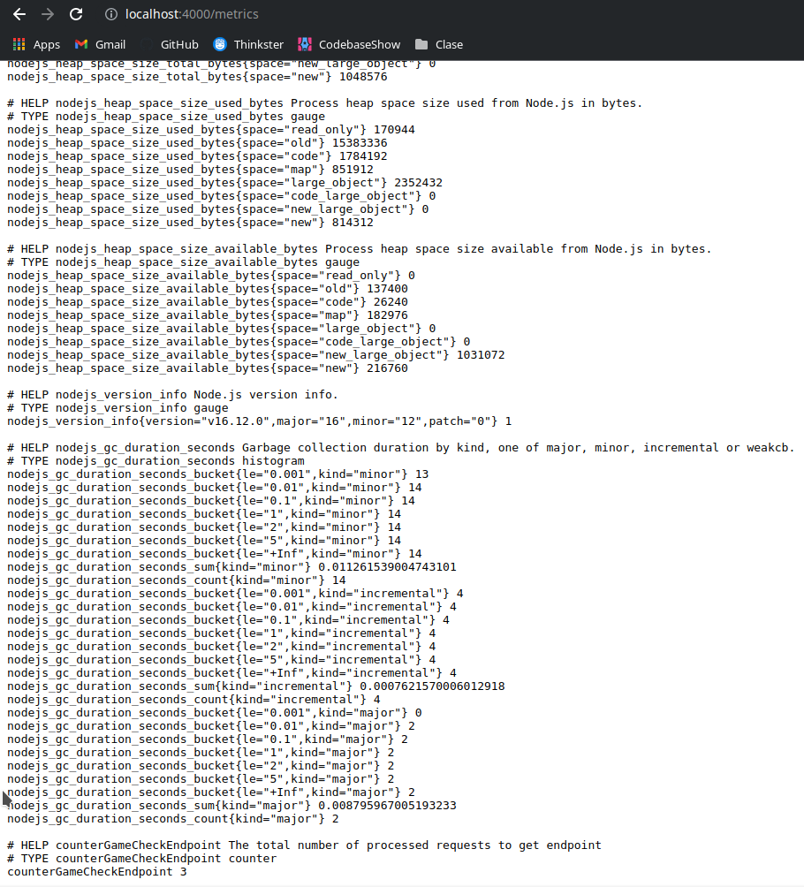

# Game-Checkpoint_Angular-Express (Docker Compose)

Creador: Fco. Javier Diez Garcia

Tipo: CFGS Proyect

Instituto: IES L'Estacio

Curso: Web Applications Development

# Index

- [Game-Checkpoint_Angular-Express (Docker Compose)](#game-checkpoint_angular-express-docker-compose)
- [Index](#index)
- [Introduction](#introduction)
- [Teoria](#teoria)
  - [Docker Compose](#docker-compose)
  - [Kubernetes](#kubernetes)
- [Steps Dockeritation](#steps-dockeritation)
  - [1. Tag Repositorio](#1-tag-repositorio)
  - [2. Comprobacion Repositorio Remoto](#2-comprobacion-repositorio-remoto)
  - [3. Creacion Rama 'main_docker_compose'](#3-creacion-rama-main_docker_compose)
  - [4. Creacion Dockerfile](#4-creacion-dockerfile)
  - [5. Creacion del docker-compose](#5-creacion-del-docker-compose)
  - [6. Archivo Enviroment con las variables](#6-archivo-enviroment-con-las-variables)
  - [7. Arranque de la aplicacion](#7-arranque-de-la-aplicacion)
  - [8. Comprobacion del funcionamiento](#8-comprobacion-del-funcionamiento)
- [Añadir Prometheus y Grafana](#añadir-prometheus-y-grafana)
  - [1. Añadir al docker-compose los dos servicios o crear uno nuevo](#1-añadir-al-docker-compose-los-dos-servicios-o-crear-uno-nuevo)
  - [2. Creacion Datasources para Grafana](#2-creacion-datasources-para-grafana)
  - [3. Creacion de Prometheus para este.](#3-creacion-de-prometheus-para-este)
  - [4. Paquetes para Express](#4-paquetes-para-express)
  - [5. Utilizacion de los paquetes desde express](#5-utilizacion-de-los-paquetes-desde-express)
  - [6. Modificar backend para poder acceder a la metricas](#6-modificar-backend-para-poder-acceder-a-la-metricas)
  - [7. Comprobacion de prometheus](#7-comprobacion-de-prometheus)
  - [8. Comprobacion de la ruta /metrics](#8-comprobacion-de-la-ruta-metrics)
  - [9. Comprobacion de Grafana](#9-comprobacion-de-grafana)

# Introduction


Mediante la utilizacion de un Dockerfile con stages, un .env.dev, scripts y el Docker Compose se genera un sistema para el funcionamiento optimo de la aplicacion de Angular-Express-GraphQL-MongoDB.


# Teoria


## Docker Compose
***

Compose es una herramienta para la definicion y funcionamiento de aplicaciones en multiples contenedores. Con Compose, puedes utilizar un fichero YAML para configurar como seran los servicios de tu aplicacion. Entonces, con un simple comando podras crear e iniciar todos los servicios de tu configuracion. Compose funciona en todos los entornos del desarollo: produccion, staging, desarollo y testing.

Para hacer funcionar tu Compose necesitaras:

- Definir el entorno de tu aplicacion mediante un dockerfile o imagen de DockerHub para ser reutilizada en cualquier parte.

- Definir los servicios que componen tu aplicacion en el docker-compose.yml para que ellos funcionen juntos y de manera aisolada.

- Ejecuta el docker-compose up para que la aplicacion se ponga en marcha.

## Kubernetes
***
La orquestacion de contenedores es manejar el ciclo de vida de estos, en particular en entornos grandes y dinamicos. Automatiza el desarollo, el sistema de redes, la escalada y viabilidad de la contencion de cargas en los servicios. Kubernetes se ha convertido en el estandar para la orquestacion de contedores a nivel global.

El cluster es lo que conseguimos cuando despliegas un Kubernete en maquinas fisicas o virutales. Consiste en dos tipos de maquinas:

- Workers: Los recursos usados para ejecurtar los servicios necesitados.
  
- Panel de control de hosts: Usados para manejar a los workers y monitorizar tods la actividad del sistema.

Todo cluster tiene al menos un worker y el panel de control puede ser localizado en un unica maquina. En entornos de produccion, hay normalmente un gran numero de workers, dependiendo del numero de contenedores a ejecutar y el panel de control esta distribuido a lo largo de multiples maquinas para conseguir la maxima viabilidad y tolerancias de errores.

# Steps Dockeritation


## 1. Tag Repositorio

> En este paso hemos creado el tag y hemos hecho un push al repositorio remoto
>
>

```bash
# Comandos Utilizados:
git tag v0.6 -m "Version Beta de la App Dockerizada";
```

## 2. Comprobacion Repositorio Remoto
> A continuacion comprobamos que en el repositiorio esta el nuevo tag
>
>

```bash
# Comandos Utilizados:
git push origin --tags;
```

## 3. Creacion Rama 'main_docker_compose'
> Lo siguiente es crear la rama main_docker_compose donde tendremos todo lo nuevo sin afectar a la rama principal
> 
> 
```bash
# Comando Utilizado:
git checkout -b "main_docker_compose";
```

## 4. Creacion Dockerfile
> Dentro de esta creamos un dockerfile con multistage para reducir de 3 dockerfiles a uno y hacerles target mas tarde en el docker-compose
> 
> 
```dockerfile
FROM node:16.12.0-buster-slim as client
RUN mkdir /project
WORKDIR /project
CMD npm install && npm run start

FROM node:16.12.0-buster-slim as s_express
RUN mkdir /project
WORKDIR /project
CMD npm install && npm run dev

FROM node:16.12.0-buster-slim as s_graphql
RUN mkdir /project
WORKDIR /project
CMD npm install && npm run dev
```

## 5. Creacion del docker-compose

> Se compondra de 4 servicios, de los cuales 3 seran buildeados apartir del target al dockerfile y otro mas de mongo sin dockerfile, sino apartir de una imagen.
>
> Todas las variables de entorno y los puertos se pasaran apartir de un fichero .env.dev. Los dos servidores GraphQL y Express dependeran de MongoDB a su mismo MongoDB gracias a la carpeta /docker-entrypoint-initdb.d y un montaje con un script se restaura automaticamente la base de datos.
>
>
```yaml
version: "3.7"
services:
  s_graphql:
    build:
      context: ./
      target: s_graphql
    container_name: game-check_graphql
    volumes:
    - ./backend/graphql:/project
    ports:
      - "${PORT_S_GRAPHQL}:${PORT_S_GRAPHQL}"
    environment:
      DB_MONGO_URI: ${DB_MONGO_URI}
      PORT: ${PORT_S_GRAPHQL}
    networks:
      - game-check-point
    depends_on:
      - "db"
  s_express:
    build:
      context: ./
      target: s_express
    container_name: game-check-express
    volumes:
    - ./backend/express:/project
    ports:
      - "${PORT_S_EXPRESS}:${PORT_S_EXPRESS}"
    environment:
      DB_MONGO_URI: ${DB_MONGO_URI}
      JWT_SECRET: ${JWT_SECRET}
    networks:
      - game-check-point
    depends_on:
      - "db"
  client:
    build:
      context: ./
      target: client
    container_name: game-check-angular
    volumes:
    - ./frontend:/project
    ports:
      - "80:${PORT_CLIENT}"
    networks:
      - game-check-point
  db:
    image: mongo:5.0.3
    container_name: gamecheckmongodb
    volumes:
      - ./scripts/mongo-restore.sh:/docker-entrypoint-initdb.d/mongo-restore.sh
      - ./dump/:/docker-entrypoint-initdb.d/dump/
    ports:
      - "${PORT_DB}:${PORT_DB}"
    networks:
      - game-check-point

networks:
  game-check-point:
volumes:
  gameCheckVol:
```

## 6. Archivo Enviroment con las variables
> Tendremos la url del servidor de mongo, el secret de JWT y todos los puertos utilizados en el docker-compose.
> 
>

```env
DB_MONGO_URI=mongodb://gamecheckmongodb:27017/game-checkpoint
JWT_SECRET=isATestSecret
PORT_S_EXPRESS=4000
PORT_S_GRAPHQL=4001
PORT_DB=27017
PORT_CLIENT=4200
```
## 7. Arranque de la aplicacion
> Mediante docker-compose up y el parametro --env-file pondremos en marcha la aplicacion
> 
>
```bash
#Comando a utilizar
docker-compose --env-file ./.env.dev up
```

## 8. Comprobacion del funcionamiento
> Una vez acabado de cargar entramos atraves de localhost y el puerto (80 en mi caso) y comprobamos que la aplicacion funciona correctamente.
> 
>

# Añadir Prometheus y Grafana

## 1. Añadir al docker-compose los dos servicios o crear uno nuevo
> Añadimos al docker-compose o creamos uno nuevo con los dos siguientes servicios, prometheus dependiendo de express y grafana de prometheus. 
> 
>
```yaml
prometheus:
    image: prom/prometheus:v2.20.1
    container_name: prometheus
    volumes:
    - ./prometheus/prometheus.yml:/etc/prometheus/prometheus.yml
    ports:
    - "${PORT_PROMETHEUS}:${PORT_PROMETHEUS}"
    depends_on:
    - s_express
    command: ["--config.file=/etc/prometheus/prometheus.yml"]
    networks:
    - game-check-point
grafana:
    image: grafana/grafana:7.1.5
    container_name: grafana
    environment:
    - GF_DISABLE_LOGIN_FORM=true
    - GF_AUTH_ANONYMOUS_ORG_ROLE=Admin
    - GF_AUTH_ANONYMOUS_ENABLED=true
    - GF_INSTALL_PLUGINS=grafana-clock-panel 1.0.1
    volumes:
    - myGrafanaVol:/var/lib/grafana
    - ./grafana/datasources.yml:/etc/grafana/provisioning/datasources/datasources.yml
    ports:
    - "3500:3000"
    depends_on:
    - prometheus 
    networks:
    - game-check-point
```
## 2. Creacion Datasources para Grafana
> Creamos la configuracion que pasamos por el punto de montaje, dandole el nombre del contenedor y el puerto
> 
>
```yaml
apiVersion: 1
datasources:
  - name: Prometheus
    type: prometheus
    access: proxy
    orgId: 1
    url: prometheus:9090
    basicAuth: false
    isDefault: true
    editable: true
```
## 3. Creacion de Prometheus para este.
> Creamos el fichero de configuracion del prometheus que le pasamos por el montaje dandole el target de express
> 
>
```yaml
global:
  scrape_interval: 5s
  evaluation_interval: 30s
scrape_configs:
  - job_name: "game-checkpoint"
    honor_labels: true
    static_configs:
      - targets: ["s_express:4000"]
```
## 4. Paquetes para Express
> Instalamos mediante npm los dos paquetes necesarios prom-client y response-time
> 
>
```bash
#Comandos a utilizar
npm install --save prom-client response-time
```

## 5. Utilizacion de los paquetes desde express
> Dentro del backend de express utilizaremos el prom-client, recolectaremos la metricas y crearemos el contador para despues utilizarlo en cualquiera de las rutas (podriamos crear un contador por endpoint).
> 
>

```javascript
var client = require('prom-client');

const collectDefaultMetrics = client.collectDefaultMetrics;
collectDefaultMetrics({ timeout: 5000 });

const counterGameCheckEndpoint = new client.Counter({
    name: 'counterGameCheckEndpoint',
    help: 'The total number of processed requests to get endpoint'
});

// Y esto detro de una ruta counterGameCheckEndpoint.inc();
```

## 6. Modificar backend para poder acceder a la metricas
> Para poder acceder a las metricas en el archivo index.js de routes crearemos los siguientes dos trozos de codigo uno de ellos para pasarle la ruta de metrics y poder acceder.
> 
>

```javascript
var router = require('express').Router();
var client = require('prom-client');

router.get('/metrics', async (req, res) => {
    res.set('Content-Type', client.register.contentType);
    res.end(await client.register.metrics());
});
```

## 7. Comprobacion de prometheus
> Una vez hecho los pasos anteriores y vuelto a hacer un docker-compose up del nuevo docker-compose o del antiguo modificado accedemos a localhost:9090/targets para comprobar nuestro endpoint.
> 
>

## 8. Comprobacion de la ruta /metrics
> Entramos en la ruta localhost:4000/metrics y comprobamos que al final nos sale el contrador creado por nosotros, si entramos a la ruta que incrementa podremos comprobar como el numero final cambia segun las peticiones ( counterGameCheckEndpoint Num )
> 
>

## 9. Comprobacion de Grafana
> Ya por ultimo comprobamos que en Grafana mediante la ruta localhost:3500/ y dentro de esta yendo a explore podremos acceder a un dropdown que pone metrics y ahi seleccionar nuestro endpoint
> 
>